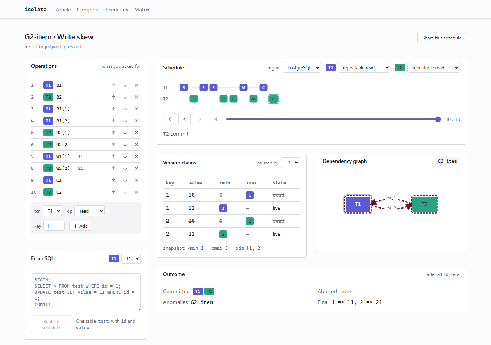
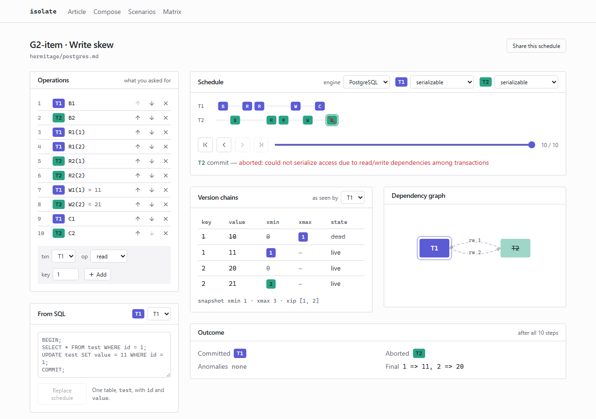
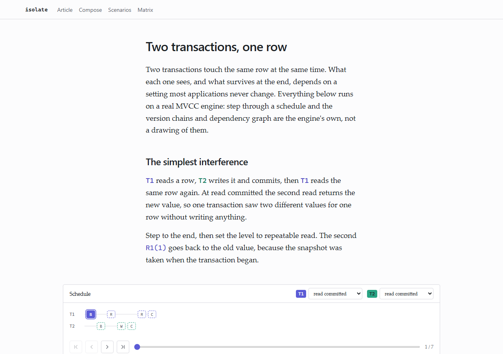

# isolate

> Compose two concurrent transactions, step through them, and watch the anomaly your isolation level allows.

  
  
  
  

   11, 2 => 21.">

Point it at a schedule and it runs the thing itself. The version chains, the snapshot bounds, the
dependency edges and the cycle are all read out of a working MVCC engine, one operation at a time,
so a claim on screen is the engine's answer rather than an illustration of one.

The part worth checking is that the engine is not tuned to agree with the picture. Every anomaly in
Martin Kleppmann's Hermitage suite is a golden test, all seventy cells of his published matrix are
reproduced, and each expectation was also driven against a real PostgreSQL 18.4 in Docker with
concurrent psql sessions as a second, independent oracle.

## How it works

1. Build a schedule, load one of the fifteen Hermitage scenarios, or paste SQL and let the engine
   parse it.
2. The engine executes it operation by operation against an MVCC store with real snapshots and
   first-committer-wins SSI.
3. Every step returns the full state: versions, per transaction visibility, dependency edges, and
   any cycle in them.
4. The three panels render that one step, so the timeline, the version chains and the graph cannot
   disagree with each other.
5. Change the level or reorder an operation and the whole thing re-runs.

## Features

**The same schedule, one setting apart.** Write skew commits at repeatable read and leaves the
database inconsistent. At serializable the engine detects the pivot and aborts it with the error
PostgreSQL actually raises.

   11, 2 => 20.">

**Every cell of the published matrix, computed live.** Seven engine and level combinations against
ten anomalies, run on demand rather than transcribed. A cell that disagrees with the published
table is marked in red instead of hidden, and every cell opens the schedule that produced it.

  

**The labels disagree with the behaviour, and it shows.** PostgreSQL's repeatable read is snapshot
isolation. MySQL's is weaker again and loses an update where PostgreSQL raises a serialization
error. Running one schedule against different engine profiles puts that contradiction side by side.

**Anomalies are encoded by form, not by colour.** Cycle edges thicken and gain a dash animation, a
pivot node is ringed in a dash, and versions a transaction cannot see are hatched. All of it
survives greyscale, and the three transaction colours were measured at 64.2 CIE76 separation under
protanopia rather than picked by eye.

**Reorder an operation and watch the cycle appear or vanish.** The schedule is editable in place,
and it round trips through the URL so a composed one can be shared.

**An article that argues with a working engine underneath it.** Six sections, each carrying a live
figure the reader drives. Nothing is bound to scroll position: every figure owns its own schedule
and step index, and the control is always a button the reader presses.

  

## Tech

| Layer | Choice |
| --- | --- |
| Engine | Python 3.13. MVCC store, isolation levels as data, dependency graph, anomaly detection |
| Engine API | FastAPI on uvicorn. Runs a schedule and returns every step |
| SQL | sqlglot, parsing the supported subset into operations |
| Frontend | Next.js 16 on React 19, TypeScript strict |
| Graph layout | dagre |
| Version chains | TanStack Table |
| Icons | lucide-react |
| Checks | pytest and hypothesis on the engine, Playwright and axe on the UI |

## Notes on the stack

**The timeline and the graph are hand written SVG, and the layout is not.** React Flow 12.10 and
12.11 both render zero edges on React 19.2: its own two node example from the docs produces correct
nodes, a correct store, and an empty edge layer. Rather than pin React back, the graph draws its own
edges. dagre still owns every coordinate, because a layout algorithm is exactly the kind of thing
that should not be hand rolled.

**Write-write conflicts block rather than error.** A blocked transaction queues and its later
statements wait, which is what a real engine does and what every Hermitage schedule assumes. Without
it the published schedules cannot be replayed at all.

**The panels are built so they cannot disagree.** Nothing here proves by test that the version table
matches the graph. Instead every panel takes the same step object, holds no index of its own and
never refetches, so disagreement is not a bug that can occur.

**Dark mode keeps the transaction fills fixed.** The three step 9 tokens are identical in both
themes, so a transaction never changes hue. Only the ground, the text ramp and the cycle halo flip,
because a dark halo on a dark ground is invisible.

## Requirements

- Python 3.13 and [uv](https://docs.astral.sh/uv/)
- Node 20 or newer

## Setup

Start the engine:

    cd engine
    uv sync
    uv run uvicorn isolate.api:app --port 8000

Then the frontend, in a second terminal:

    cd frontend
    npm install
    npm run dev

The frontend reads `NEXT_PUBLIC_ENGINE_URL` and falls back to `http://127.0.0.1:8000`. Set it in
`frontend/.env.local` if the engine runs anywhere else.

## Layout

    engine/     MVCC store, isolation levels, dependency graph, anomaly detection, FastAPI
    frontend/   The article, the workbench, the three panels, the matrix

## Checks

Engine, 204 tests including the Hermitage goldens and hypothesis generated schedules:

    cd engine
    uv run pytest

Frontend. The audit runs every route at 1440 and 375, and fails on nested containers, offscreen
elements, hover styles on things that cannot be clicked, missing pointer cursors, sideways scroll,
axe violations, and computed WCAG contrast in both themes:

    cd frontend
    npm run typecheck
    npm run lint
    npm run test:e2e
